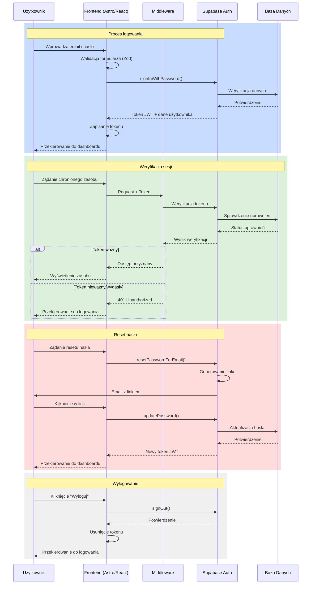

# Diagram przepływu autentykacji

## Legenda

1. **Aktorzy**:
   - Użytkownik - końcowy użytkownik systemu
   - Frontend - warstwa prezentacji (Astro + React)
   - Middleware - warstwa autoryzacji żądań
   - Supabase Auth - system autentykacji
   - Baza Danych - przechowywanie danych użytkowników

2. **Procesy**:
   - Logowanie (niebieski) - podstawowy proces autentykacji
   - Weryfikacja sesji (zielony) - sprawdzanie uprawnień dostępu
   - Reset hasła (czerwony) - odzyskiwanie dostępu
   - Wylogowanie (szary) - zakończenie sesji

3. **Zabezpieczenia**:
   - Walidacja formularzy przez Zod
   - Tokeny JWT do autoryzacji
   - Bezpieczne połączenie HTTPS
   - Szyfrowanie haseł przez Supabase
